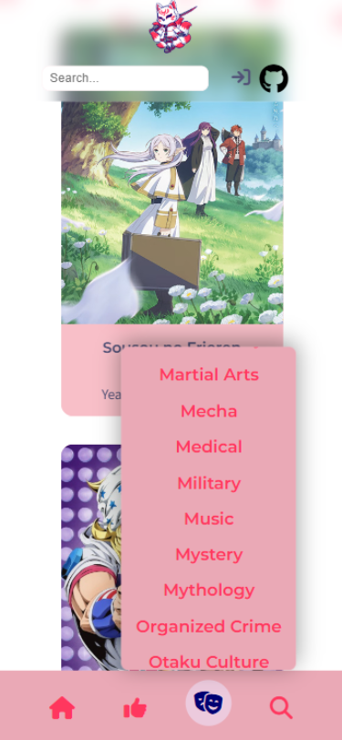
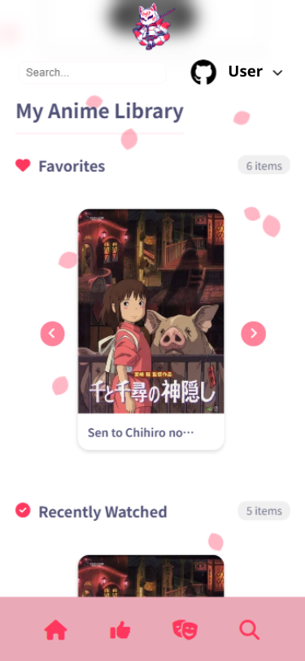
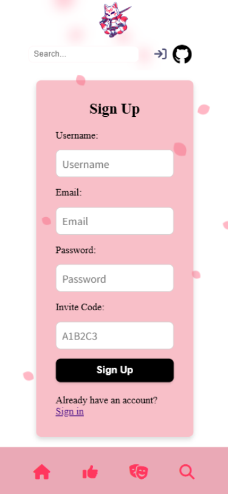

<p align="right">
  🌐 <a href="README_EN.md">English version</a>
</p>

# Otaku Library – Anime böngésző és listakezelő rendszer

**Nyelv:** HU Magyar | [GB English](README_EN.md)

## Képernyőképek

| Főoldal | Adatlap | Felhasználói fiók | Bejeletkezés |
|:---:|:---:|:---:|
|  |  |  |  |

| Keresés | Mobil nézet | Felhasználói fiók | Bejeletkezés |
|:---:|:---:|:---:|
|  |  |  |  |

Ez a projekt egy modern, Node.js alapú anime adatbázis és közösségi listakezelő alkalmazás, amely a **Jikan API (MyAnimeList)** adataira épül. A szoftver lehetővé teszi az animék közötti böngészést, részletes adatlapok megtekintését és egyéni gyűjtemények (Kedvencek, Megnézendő, Befejezett) kezelését.

---

## Leírás

A projekt célja egy funkciógazdag és biztonságos platform létrehozása az anime rajongók számára, amely:
- **Dinamikusan lekéri** a legfrissebb szezonális és toplistás animéket **külső API-n keresztül.**
- Személyre szabott profilokat kínál regisztrációval és jelszóhasheléssel **(bcrypt)**.
- **CRUD alapú listakezelést biztosít:** animék hozzáadása, törlése és rendszerezése egyéni listákba.
- **NSFW (Adult content) szűrést alkalmaz**, amely felhasználói szinten ki-be kapcsolható.
- **Intelligens keresőt tartalmaz** autocomplete funkcióval a gyorsabb találatokért.
- **MVC (Model-View-Controller) architektúrát követ** a moduláris és tiszta kód érdekében.
- **Reszponzív Design:** SASS alapú, Mobile-First megközelítésű felület.

---

## Könyvtárstruktúra

```text
otaku_library/ 
│   README.md
│   README_EN.md
│
├───app/                    # Alkalmazás magja
│   │   index.js            # Belépési pont (Express setup, Middleware-ek, Route-ok)
│   │   db.js               # PostgreSQL kapcsolat (Pool setup)
│   │   .env                # Érzékeny adatok (DB hozzáférés, Session secret)
|   |   otaku_library.sql   # Adatbázis
│   │
│   ├───config/             # Passport.js konfiguráció (Local Strategy)
│   │
│   ├───controllers/        # Üzleti logika: animeController, authController, listController
│   │
│   ├───utils/              # Segédfüggvények (NSFW szűrő logika)
│   │
│   └───views/              # EJS sablonok (HTML struktúra)
│       ├───auth/           # Login, Register, Account oldalak
│       ├───pages/          # Genre, Toplist, Details oldalak
│       ├───partials/       # Újrafelhasználható elemek (Header, Footer)
│       └───index.ejs       # Főoldal
└───public/                 # Statikus fájlok
        ├───styles/         # Stíluslapok (Custom CSS)   
        ├───js/             # Kliensoldali JS (Autocomplete, UI interakciók)   
        ├───images/         # Képek, ikonok
        └───otaku.ico       # Az oldal ikonja (favicon)

```

---

## Adatbázis (PostgreSQL)

### Táblák:
1. users – Felhasználók adatai (username, email, password_hash, allow_nsfw).
2. user_anime_lists – A felhasználók mentett animéi (anime_id, cím, kép, típus: favorite/watched/wishlist).
3. session – Perzisztens munkamenetek tárolása (connect-pg-simple).
4. invite_codes – Regisztrációhoz szükséges meghívókódok kezelése.
5. site_settings – Dinamikus oldaltartalmak (pl. Privacy Policy szövege).

Kapcsolatok: A felhasználók és az animék között egy-a-sokhoz reláció áll fenn a listák mentésekor.

---

## Telepítés és beállítás

1. Klónozás és függőségek:

```text
git clone https://github.com/user/otaku_library.git
npm install
```

2. Adatbázis inicializálása:
  1. Hozz létre egy adatbázist otaku_library néven, majd futtasd le az alábbi SQL parancsokat:
  2. Importáld az app/otaku_library.sql fájlt

3. Környezeti változók: Hozz létre egy .env fájlt az app/ mappában:

```text
PG_USER=postgres
PG_HOST=localhost
PG_DATABASE=otaku_library
PG_PASSWORD=your_password
PG_PORT=5432
SESSION_SECRET=valami_nagyon_titkos
```

4. Szerver indítása:

```text
npm start
```

## Weboldal elérése

A projekt élőben is megtekinthető az alábbi linken: [Nézd meg élőben!](https://otakulibrary.zita.dev)

- [Főoldal megnyitása:](http://localhost:3000/)
- [Regisztráció:](http://localhost:3000/auth/register)

---

## Használt technológiák

- **Node.js & Express** – Backend keretrendszer
- **PostgreSQL** – Relációs adatbázis
- **EJS** – Sablonkezelő motor
- **Passport.js** – Hitelesítés
- **Axios** – API kérések kezelése (Jikan API)
- **Bcrypt** – Jelszó titkosítás
- **Helmet.js** – HTTP fejlécek védelme

## Rendszerkövetelmények

- Node.js v16.x vagy újabb
- PostgreSQL v13.x vagy újabb
- Aktív internetkapcsolat (az API hívásokhoz)

## Készítette
Név: Lukács Zita
Dátum: 2026. március