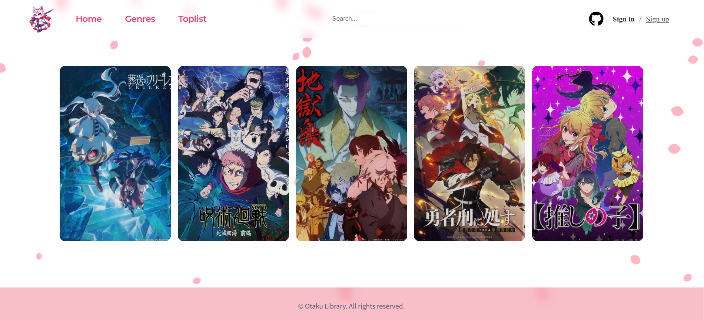
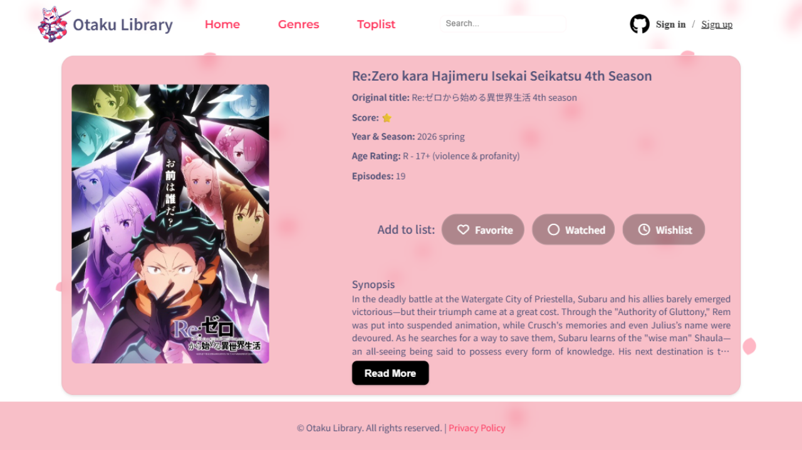
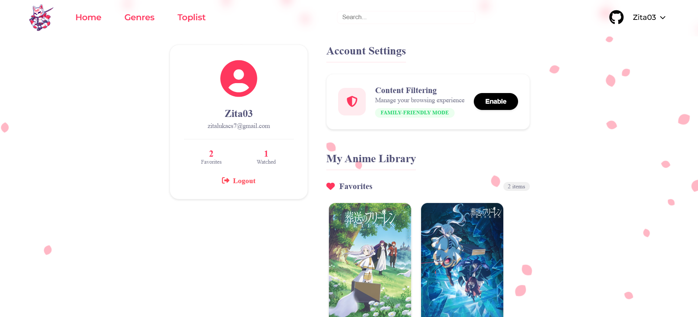
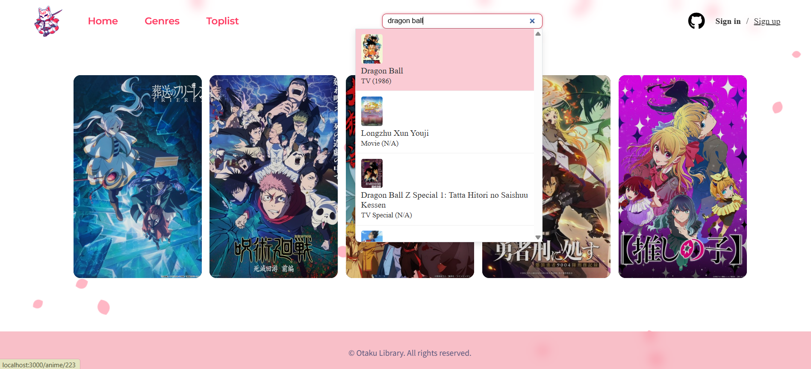
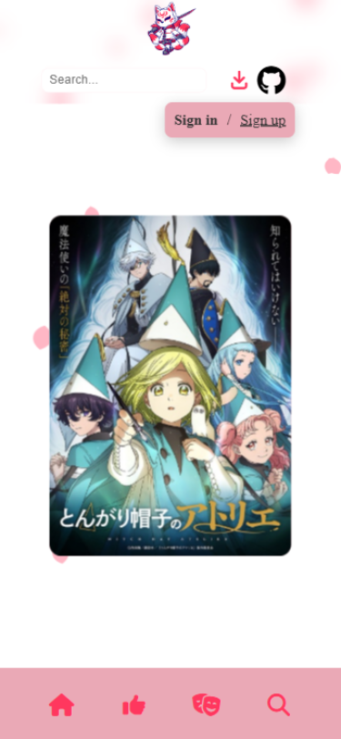
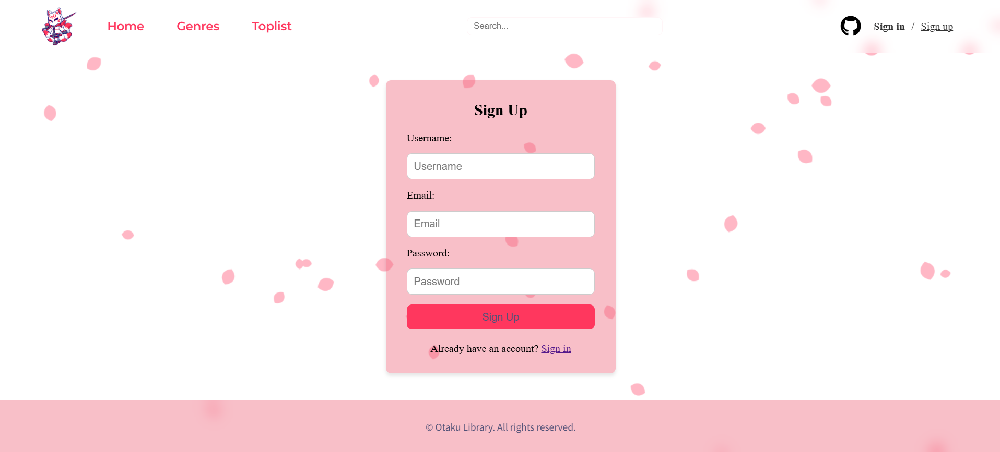

<p align="right">
  🌐 <a href="README.md">Magyar verzió</a>
</p>

# Otaku Library – Anime Browser & List Management System

**Language:** [HU Magyar](README.md) | GB English

## Screenshots

| Home page | Details | Account page |
|:---:|:---:|:---:|
|  |  |  |

| Search results | Mobile view | Sign up page |
|:---:|:---:|:---:|
|  |  |  |

This project is a modern, Node.js-based anime database and community list management application built on the **Jikan API (MyAnimeList)**. The software allows users to browse anime, view detailed info sheets, and manage personal collections (Favorites, Plan to Watch, Completed).

---

## Description

The goal of the project is to provide a feature-rich and secure platform for anime fans, featuring:
- **Dynamic Data Fetching:** Retrieves the latest seasonal and top-rated anime via external API.
- **Personalized Profiles:** Secure registration and login with password hashing **(bcrypt)**.
- **CRUD-based List Management:** Add, remove, and organize anime into custom lists.
- **NSFW (Adult Content) Filter:** User-level toggle for filtering restricted content.
- **Smart Search:** Includes an autocomplete feature for faster discovery.
- **MVC (Model-View-Controller) Architecture:** Modular and clean code structure.
- **Responsive Design:** SASS-based, Mobile-First approach.

---

Directory Structure

```text
otaku_library/ 
│   README.md
│   README_EN.md
│
├───app/                    # Application Core
│   │   index.js            Entry point (Express setup, Middlewares, Routes)
│   │   db.js               # PostgreSQL connection (Pool setup)
│   │   .env                # Sensitive data (DB access, Session secret)
|   |   otaku_library.sql   # Database schema
│   │
│   ├───config/             # Configuration (e.g., Passport.js Local Strategy)
│   │
│   ├───controllers/        # Business logic (Anime, Auth, and List controllers)
│   │
│   ├───utils/              # Helper functions (e.g., NSFW filter logic)
│   │
│   └───views/              # EJS templates (HTML structure)
│       ├───auth/           # Login, Register, Account pages
│       ├───pages/          # Genre, Toplist, Details pages
│       ├───partials/       # Reusable components (Header, Footer)
│       └───index.ejs       # Homepage
└───public/                 # Static files
        ├───styles/         # Stylesheets (Custom CSS/SASS)   
        ├───js/             # Client-side JS (Autocomplete, UI interactions)   
        ├───images/         # Images, icons
        └───otaku.ico       # Favicon (Site icon)

```

---

## Database (PostgreSQL)

### Tables:
1. **users** – User data (username, email, password_hash, allow_nsfw, is_admin).
2. **user_anime_lists** – User-saved anime (favorites, plan to watch, completed).
3. **session** – Persistent session storage (`connect-pg-simple`).
4. **invite_codes** – Management of invitation codes required for registration.
5. **site_settings** – Dynamic site content (e.g., Privacy Policy text).

Connections: A one-to-many relationship exists between users and their saved anime lists.

---

## Installation & Setup

1. Clone & Dependencies:

```text
git clone https://github.com/user/otaku_library.git
npm install
```

2. Database Initialization:
Create a database named otaku_library, then run the SQL commands provided in the otaku_library.sql file.

3. Environment Variables: Create a .env file in the app/ folder:

```text
PG_USER=postgres
PG_HOST=localhost
PG_DATABASE=otaku_library
PG_PASSWORD=your_password
PG_PORT=5432
SESSION_SECRET=your_secret_key
```

4. Start the Server:

```text
npm start
```

## Accessing the Website

Live Demo
The project is available live at the following link: **[otakulibrary.zita.dev](https://otakulibrary.zita.dev)**

- [Open Home page:](http://localhost:3000/)
- [Sign up page](http://localhost:3000/auth/register)

---

## Technologies Used

- **Node.js & Express** – Backend framework
- **PostgreSQL** – Relational database
- **EJS** – Template engine
- **Passport.js** – Authentication
- **Axios** – API requests (Jikan API)
- **Bcrypt** – Password hashing
- **Helmet.js** – HTTP header security

## System Requirements
- Node.js v16.x or newer
- PostgreSQL v13.x or newer
- Active internet connection (for API calls)

## Created by
Name: Zita Lukács
Date: March 2026